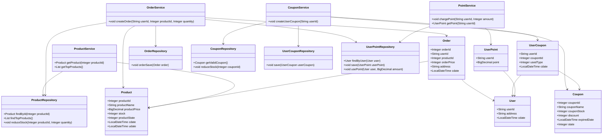

# 클래스 다이어그램

```mermaid
classDiagram

class Product {
  +Integer productId
  +String productName
  +BigDecimal productPrice
  +Integer stock
  +Integer productState
  +LocalDateTime cdate
  +LocalDateTime udate
}

class Order {
  +Integer orderId
  +String userId
  +Integer productId
  +Integer orderPrice
  +String address
  +LocalDateTime cdate
}

class Coupon {
  +Integer couponId
  +String couponName
  +Integer couponStock
  +Integer discount
  +LocalDateTime expiredDate
  +Integer state
}

class UserCoupon {
  +String userId
  +Integer coupontId
  +Integer usedType
  +LocalDateTime cdate
}

class UserPoint {
  +String userId
  +BigDecimal point
}

class User {
  +String userId
  +String address
  +LocalDateTime cdate
}

class ProductRepository {
  +Product findById(Integer productId)
  +List<Product> findTopProducts()
  +void reduceStock(Integer productId, Integer quantity)
}

class OrderRepository {
  +void orderSave(Order order)
}

class CouponRepository {
  +Coupon getValidCoupon()
  +void reduceStock(Integer couponId)
}

class UserCouponRepository {
  +void save(UserCoupon userCoupon)
}

class UserPointRepository {
  +User findByUser(User user)
  +void save(UserPoint userPoint)
  +void usePoint(User user, BigDecimal amount)
}

class ProductService {
  +Product getProduct(Integer productId)
  +List<Product> getTopProducts()
}

class OrderService {
  +void createOrder(String userId, Integer productId, Integer quantity)
}

class CouponService {
  +void createUserCoupon(String userId)
}

class PointService {
  +void chargePoint(String userId, Integer amount)
  +UserPoint getPoint(String userId)
}

ProductService --> ProductRepository
OrderService --> ProductRepository
OrderService --> OrderRepository
OrderService --> UserPointRepository
CouponService --> CouponRepository
CouponService --> UserCouponRepository
PointService --> UserPointRepository

OrderService --> Product
OrderService --> Order
PointService --> UserPoint
CouponService --> Coupon
CouponService --> UserCoupon
ProductService --> Product

Order --> User
Order --> Product
UserCoupon --> User
UserCoupon --> Coupon
UserPoint --> User 
```
